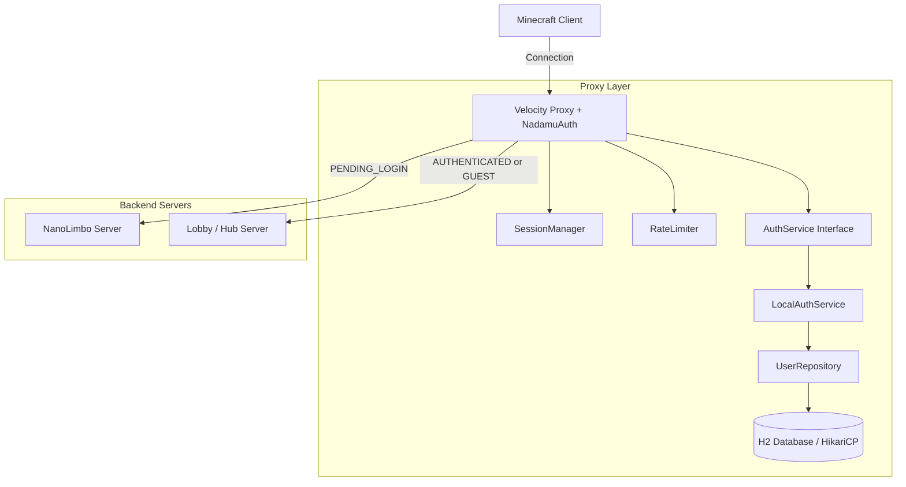
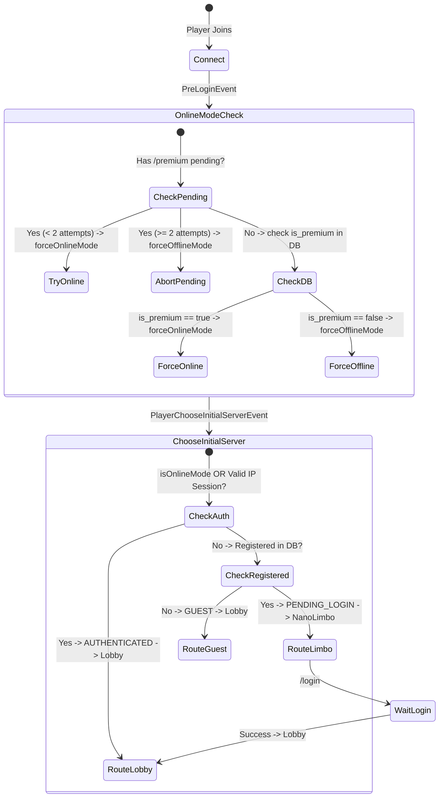

# System Architecture Overview

`NadamuAuth` is a proxy-level authentication plugin designed for Velocity 4.0+.

## High-Level Topology

## Connection Routing & State Machine

## Component Breakdown

1. **`NadamuAuthPlugin`**: Central lifecycle and dependency injector for proxy events and commands.
2. **`SessionManager`**: In-memory state tracking (`GUEST`, `PENDING_LOGIN`, `AUTHENTICATED`), IP-based session cache via Caffeine, and pending `/premium` request tracking.
3. **`RateLimiter`**: Sliding-window attempt tracking per IP and username to mitigate brute-force password guessing.
4. **`LocalAuthService`**: Concrete implementation of `AuthService` handling password verification and account creation.
5. **`DatabaseManager` & `UserRepository`**: Asynchronous persistence layer backed by H2 and HikariCP.
6. **`ConnectionListener` & `RestrictionListener`**: Velocity event interceptors enforcing chat, command, and server transfer restrictions.
