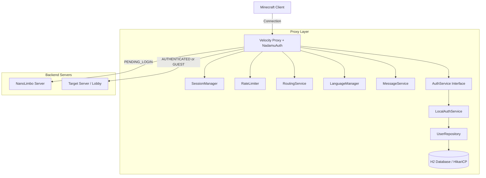
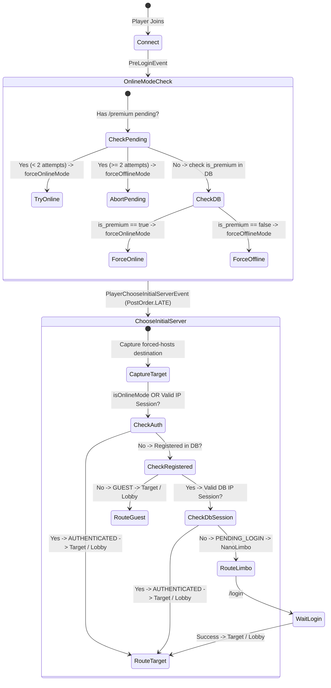

# System Architecture Overview

`NadamuAuth` is a high-performance proxy-level authentication plugin designed for Velocity 4.0+.

## High-Level Topology

## Connection Routing & State Machine

## Component Breakdown

1. **`NadamuAuthPlugin`**: Central lifecycle coordinator and dependency injector for proxy events and commands.
2. **`RoutingService`**: Manages player destination resolution, preserving `forced-hosts` (e.g. `pvp.example.com`) across authentication while enforcing safe fallback to `lobbyServer`.
3. **`SessionManager`**: In-memory state tracking (`GUEST`, `PENDING_LOGIN`, `AUTHENTICATED`), login timeout cancellation, and pending `/premium` request tracking.
4. **`RateLimiter`**: Sliding-window attempt tracking per IP and username to mitigate brute-force password attacks.
5. **`LanguageManager` & `MessageService`**: Dynamic multi-language dictionary loading (`languages/*.yml`), client locale auto-detection, and Adventure MiniMessage rendering with interactive components.
6. **`LocalAuthService`**: Implementation of `AuthService` handling password verification, registration, and BCrypt hashing.
7. **`DatabaseManager` & `UserRepository`**: Asynchronous persistence layer backed by embedded pure Java H2 and HikariCP connection pooling, providing persistent IP session lookup and guest-to-premium account creation.
8. **`ConnectionListener` & `RestrictionListener`**: Velocity event interceptors enforcing strict NanoLimbo isolation (command whitelist `/login`, `/l`, `/register`, `/r`, `/reg` and chat suppression), timeout management, and seamless post-auth routing.
